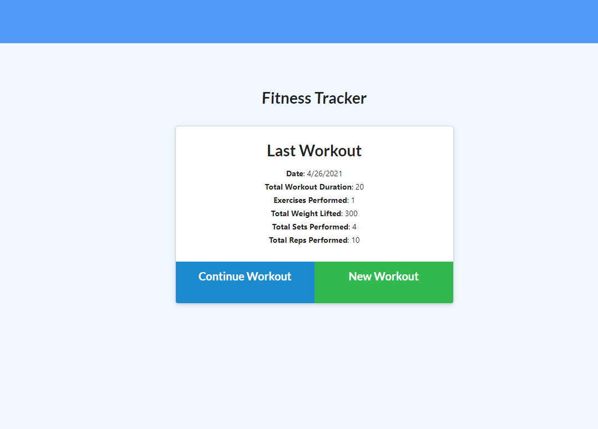
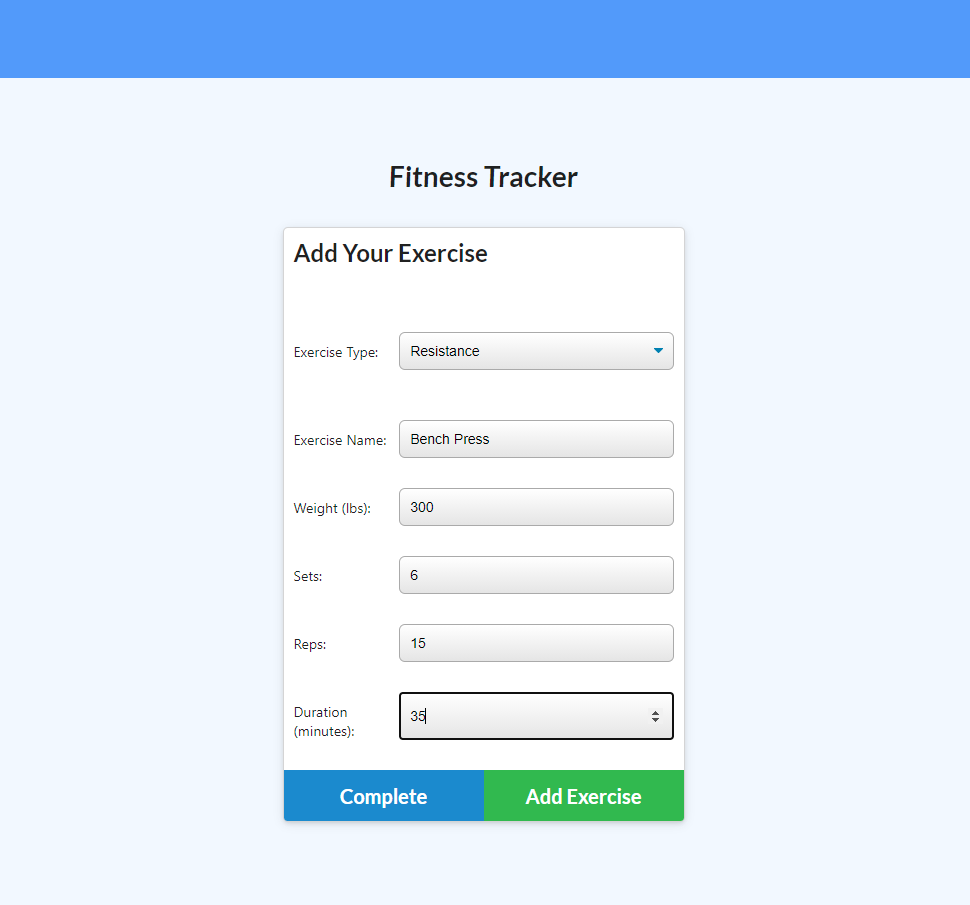
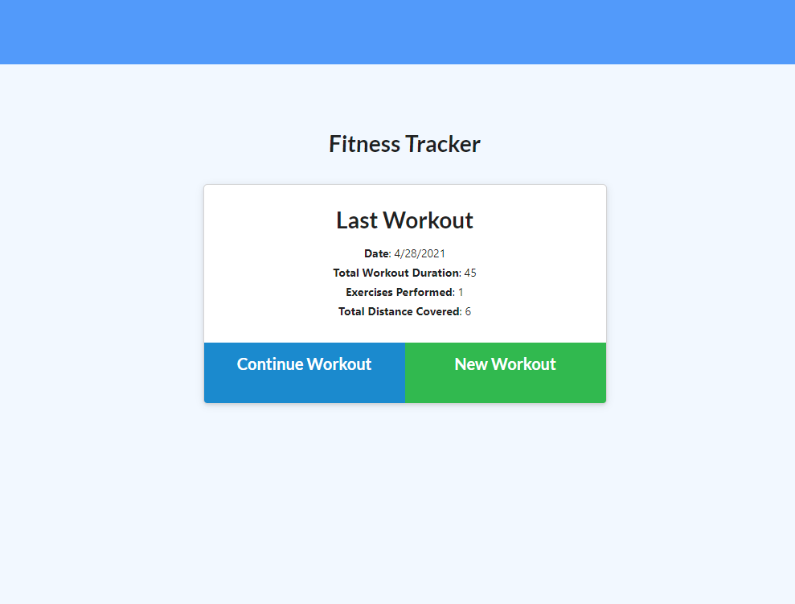

# WORKOUT TRACKER

For this assignment, I'll be creating a workout tracker. I have already been provided with the front end code in a `Develop` folder. This assignment will require me to create Mongo database with a Mongoose schema and handle routes with Express.

## User Story

* As a user, I want to be able to view create and track daily workouts. I want to be able to log multiple exercises in a workout on a given day. I should also be able to track the name, type, weight, sets, reps, and duration of exercise. If the exercise is a cardio exercise, I should be able to track my distance traveled.

## Business Context

A consumer will reach their fitness goals more quickly when they track their workout progress.

## Acceptance Criteria

When the user loads the page, they should be given the option to create a new workout or continue with their last workout.

The user should be able to:

  * Add exercises to the most recent workout plan.

  * Add new exercises to a new workout plan.

  * View the combined weight of multiple exercises from the past seven workouts on the `stats` page.

  * View the total duration of each workout from the past seven workouts on the `stats` page.


### See Application
[Click Here](https://mynotetakerjs.herokuapp.com/) to see the application.


### Installation


<!-- GETTING STARTED -->

This is some useful steps, you must meet to run this Express Application correctly 

### Prerequisites
You can use any code editor of user choise, i use Vs Code because it is open source and it understand git and do syntax highlighting very nicely.

* Go to
  [Click Here](https://code.visualstudio.com/download) to download Vs Code to your computer.
  

1. Clone the repo
   ```sh
   git clone https://github.com/lemanou7/myNoteTaker.git
   ```
2. Get a linux shell emulator like Git bash or Powershell then:
    ```sh
    cd to where your repository folder is located in your computer
    ```
3. Install nodeJs on your machine


4. Install all the dependencies by entering this command in your Terminal
   ```sh
   npm install then npm run server.js
   ```

4. Go in your web browser to see the App


### See Application Screenshots

1. Full App Main Page



2. Adding Workouts



3. Showing Workout (Bench Press) Totals


4. Showing Workout (Running) Totals




<!-- CONTACT -->
## Contact

Drissa Bagate (<span style="color:#5ddcf0">**Django, Javascript Full Stack Developer**</span>) [GitHub](https://github.com/lemanou7) - lemanou7@yahoo.fr

Other Project link: [My Blog Post Python-Django Implemation](http://grandbuzz.herokuapp.com/)

